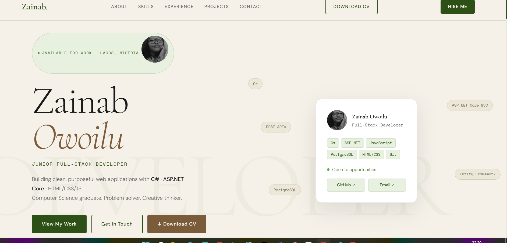

# Zainab Owoilu — Personal Portfolio

A clean, responsive personal portfolio website built with HTML, CSS, and vanilla JavaScript.

## 🔗 Live Demo
> _Add your live link here after deploying (e.g. GitHub Pages or Netlify)_

---

## 📸 Preview


---

## 🛠️ Built With

- HTML5
- CSS3 (Custom Properties, Grid, Flexbox)
- Vanilla JavaScript (Intersection Observer, Scroll Animations)
- Google Fonts (Cormorant Garamond, DM Sans, Space Mono)

---

## ✨ Features

- Responsive design — works on mobile, tablet, and desktop
- Smooth scroll animations and reveal effects
- Animated loader screen
- Downloadable CV button
- Contact form with validation
- Active navigation highlighting on scroll
- Mobile hamburger menu

---

## 📁 Project Structure

```
portfolio/
├── index.html          # Main HTML file
├── style.css           # All styles
├── script.js           # Animations and interactivity
├── Zainab-Owoilu-CV.pdf  # Downloadable resume
└── README.md           # Project documentation
```

---

## 🚀 Getting Started

To run this project locally:

1. Clone the repository
   ```bash
   git clone https://github.com/Olazee04/portfolio.git
   ```

2. Open the project folder
   ```bash
   cd portfolio
   ```

3. Open `index.html` in your browser
   — or use the **Live Server** extension in VS Code for live reloading

---

## 📬 Contact

- **Email:** owoiluzainaboluwatoyin@gmail.com
- **Phone:** +234 702 584 1728
- **GitHub:** [github.com/Olazee04](https://github.com/Olazee04)
- **Location:** Lagos, Nigeria

---

